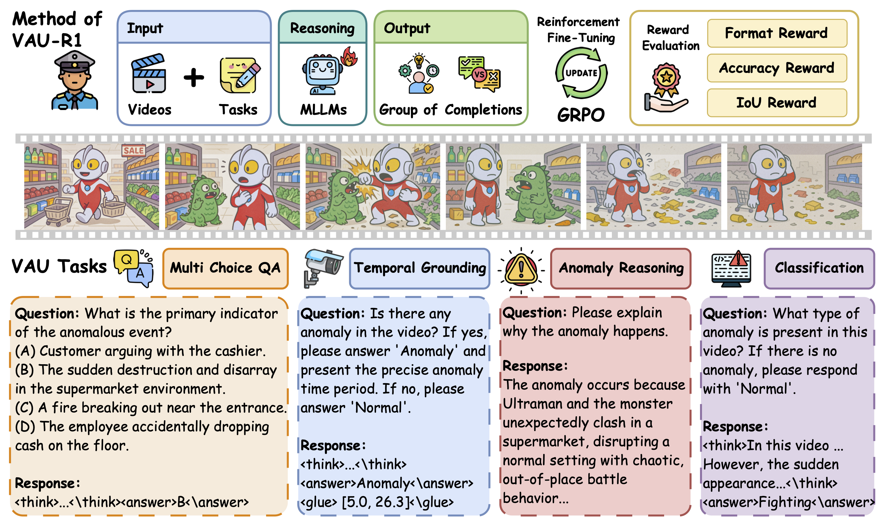
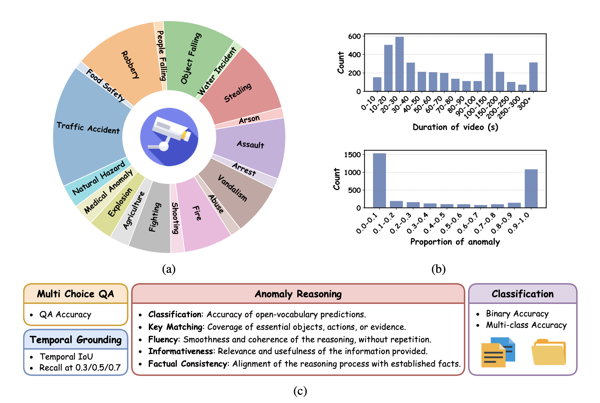

# VAU-R1: Advancing Video Anomaly Understanding via Reinforcement Fine-Tuning
<p align="center">
  <a href="https://tom-roujiang.github.io/liyun_zhu/">Liyun Zhu</a><sup>1,2</sup>, 
  <a href="https://q1xiangchen.github.io">Qixiang Chen</a><sup>1</sup>, 
  <a href="https://xishen0220.github.io">Xi Shen</a><sup>3</sup>,
  <a href="https://vinthony.github.io/academic/">Xiaodong Cun</a><sup>2</sup>
  <br>
  <sup>1</sup>Australian National University &nbsp&nbsp&nbsp&nbsp
  <sup>2</sup><a href='https://gvclab.github.io'>GVC Lab, Great Bay University</a> &nbsp&nbsp&nbsp&nbsp
  <sup>3</sup>Intellindust
  <br>
  &nbsp&nbsp 🌐 <a> Project Website (coming soon)</a> ｜ 📑 <a href="https://arxiv.org/abs/2505.23504">Paper</a> &nbsp&nbsp
  <br>
  
</p>


This repository contains the official implementation of our paper: **VAU-R1: Advancing Video Anomaly Understanding via Reinforcement Fine-Tuning**. 


We propose **VAU-R1**, a Reinforcement Fine-Tuning (RFT) framework that improves the reasoning ability of MLLMs for video anomaly understanding (VAU). Specifically, we adopt Group Relative Policy Optimization (GRPO) to optimize the model with task-specific rewards, such as answer format, accuracy, and temporal Intersection-over-Union (IoU). We decompose the VAU task into four complementary tasks to facilitate comprehensive reasoning: multiple-choice QA, temporal anomaly grounding, anomaly reasoning, and anomaly classification.


## Get Started

### 1. Environment Setup
We use Qwen2-VL and [Qwen2.5-VL](https://github.com/QwenLM/Qwen2.5-VL) as our base model. We provide a simple installation: 

```shell
pip install transformers
pip install qwen_vl_utils
```

### 2. Prepare the training data
<p align="center">

</p>

We construct **VAU-Bench**, a unified benchmark built from MSAD, UCF-Crime, and ECVA, enriched with Chain-of-Thought (CoT) annotations, including: (i) video descriptions, (ii) temporal boundaries, (iii) multiple-choice QA, and (iv) reasoning rationales.

Please download the original video files from [UCF-Crime](https://www.crcv.ucf.edu/projects/real-world/) , [ECVA](https://github.com/Dulpy/ECVA) and [MSAD](https://github.com/Tom-roujiang/MSAD) for our experiments. Our Chain of Thought annotation for these three datasets can be found in ``annotations/`` folder.


## Training

We use ``training_scripts/run_grpo_video_qa.sh`` for training the RFT for Multi-choice QA task.

````shell
sh training_scripts/run_grpo_video_qa.sh
````

We use ``training_scripts/run_grpo_video_tag.sh`` for training the RFT for temporal anomaly grouding task.

````shell
sh training_scripts/run_grpo_video_tag.sh
````


## Evaluation
Please follow the evaluation scripts in [scripts/evaluation](scripts/evaluation) folder to evaluate the model performance on four tasks.
<!-- 
For evaluating the QA correctness for Qwen model, please run:

```shell
python evaluate_qa_qwen.py\
  --csv_file ./gt_csv/output-ucf-test.csv \
  --model_path ../huggingface/Qwen2.5-VL-3B-Instruct\
  --summary_txt_path ./sum_Qwen2-VL-2B_ucf.txt\
  --dataset_name ucf\
  --gpu 3
```

For evaluating the GPT-based **VAU-Eval** score, please run the following command to get the anomaly description and analysis of the model at first.

```shell
python reasoning_qwen.py \
    --video_folder "../dataset/ucf_crime/all_videos" \
    --model_path "../huggingface/Qwen2.5-VL-7B-Instruct" \
    --output_csv "ucf-Qwen2.5vl-7B-wocot.csv" \
    --test_list_txt "json/ucf_test_new.txt" \
    --gpu 0
```

Then run the following command to evaluate the generated outputs and the ground truth.

```shell
python evaluate_deepseek.py \
  --csv_file_path ucf-Qwen2.5vl-7B-wocot.csv \
  --dataset ucf \
  --json_output_path ./ucf-Qwen2.5vl-7B-wocot.json \
  --gt_path gt_csv/output-ucf-test.csv
```

We also provide the evaluation codes for InternVL2.5. -->


## Citation

If you find our VAU-R1 useful in your research, please consider cite our work or star our repo.

## Acknowledgement 

This codebase is built on top of [VideoChat-R1](https://github.com/OpenGVLab/VideoChat-R1), and we thank the authors for their work.

